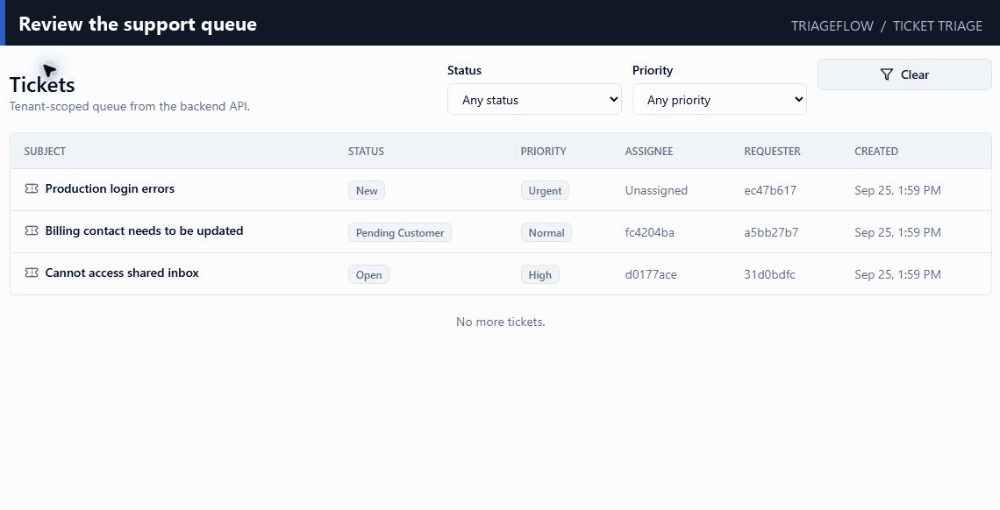
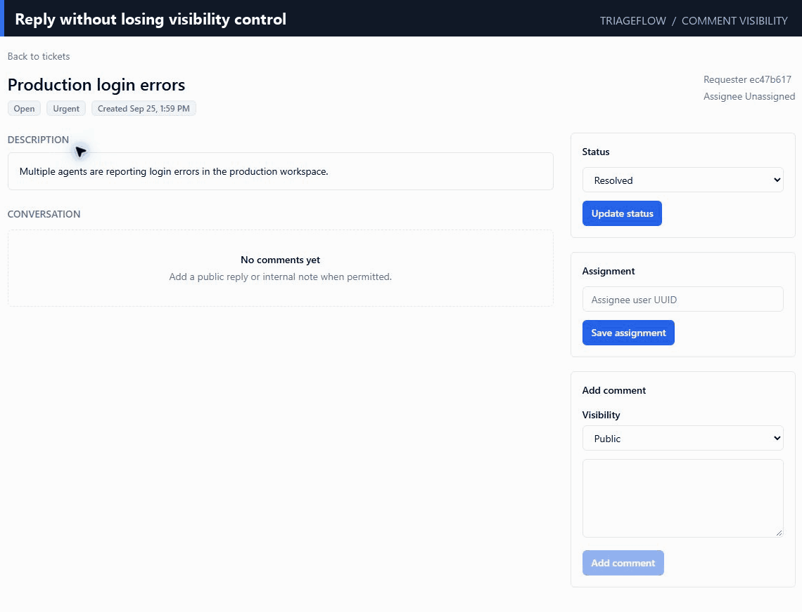
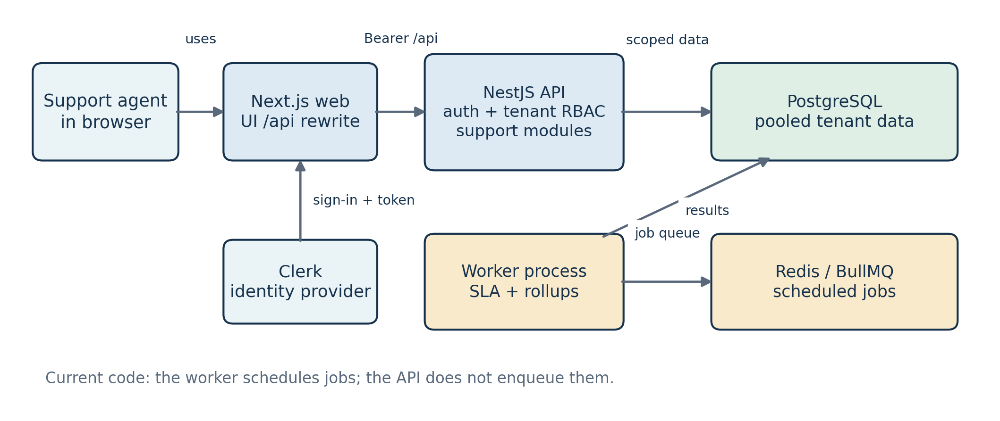

# TriageFlow

<p align="center">
  <strong>Multi-tenant support desk SaaS with tenant isolation, RBAC, audited workflows, background workers, analytics, and measured performance.</strong>
</p>

<p align="center">
  
</p>

TriageFlow is a production-style multi-tenant support desk SaaS built to demonstrate backend-heavy full-stack engineering. It models the core of a support platform where multiple workspaces can manage tickets, public customer replies, internal notes, SLA breach checks, and operational analytics without leaking data across tenants.

## Table of Contents

- [Features](#features)
- [Quick Start](#quick-start)
- [Usage](#usage)
- [Architecture](#architecture)
- [Tech Stack](#tech-stack)
- [Validation](#validation)
- [Benchmarks](#benchmarks)
- [Security Model](#security-model)
- [FAQ](#faq)
- [Documentation](#documentation)

## Features

- Multi-tenant data model with `tenant_id` on tenant-owned tables.
- Clerk authentication for identity, with application-owned users, memberships, roles, and permissions for authorization.
- Backend-enforced RBAC using tenant-scoped `RequestContext`.
- Ticket queue, ticket detail, ticket creation, status transitions, assignment, public comments, and internal notes.
- Transactional audit logging for important ticket/comment mutations.
- SLA policies, synchronous SLA satisfaction timestamps, idempotent BullMQ SLA breach workers, and repeatable worker scheduling.
- Analytics daily rollups, analytics worker jobs, protected analytics API endpoints, and a minimal permission-aware analytics dashboard.
- Opaque cursor pagination for ticket and comment lists.
- Deterministic large seed data and a k6 benchmark harness.
- Live PostgreSQL API integration tests for tenant isolation, RBAC, pagination, audit, and transactional behavior.

## Quick Start

### Prerequisites

TriageFlow uses Node.js tooling with `pnpm`, PostgreSQL, Redis, Docker Compose, and Clerk authentication.

### Install and initialize

From the repository root in Windows PowerShell:

```powershell
corepack pnpm install
Copy-Item .env.example .env
corepack pnpm infra:up
corepack pnpm db:migrate
corepack pnpm db:generate
corepack pnpm db:seed
```

If you already have a configured `.env`, keep it instead of overwriting it.

For real Clerk authentication, the environment must include:

```powershell
CLERK_SECRET_KEY="sk_test_..."
NEXT_PUBLIC_CLERK_PUBLISHABLE_KEY="pk_test_..."
CLERK_AUTHORIZED_PARTIES="http://localhost:3000"
```

### Run the application

Start the API, web app, and worker:

```powershell
corepack pnpm --filter @triageflow/api dev
corepack pnpm --filter @triageflow/web dev
corepack pnpm --filter @triageflow/worker dev
```

Open `http://localhost:3000/onboarding` to sign in, complete profile bootstrap, create a workspace, and enter the ticket queue.

## Usage

### Review and triage support tickets

The ticket queue provides a tenant-scoped view of support requests with status, priority, assignee, requester, and creation time. Agents can filter the queue and open an individual ticket for further action.

<p align="center">
  
</p>

### Update ticket state and control comment visibility

From a ticket detail page, permitted users can update ticket status and assignment and add comments. Comments can represent public customer-facing replies or internal notes, with visibility enforced by application permissions.

<p align="center">
  
</p>

A typical support workflow is:

1. Open the tenant's ticket queue.
2. Filter or select a ticket that needs attention.
3. Review its description and conversation history.
4. Update its status or assignment as needed.
5. Add a public reply or an internal note when permitted.

## Architecture

TriageFlow is a modular monolith with a separate worker process.

<p align="center">
  
</p>

The main components are:

- `apps/web`: Next.js frontend
- `apps/api`: NestJS + Fastify API
- `apps/worker`: BullMQ worker process
- `packages/db`: Prisma schema/client package
- `packages/config`: shared runtime config validation
- `packages/shared`: shared TypeScript types
- `infra`: Docker Compose and k6 scripts

The API owns authorization and business rules. Controllers do not call Prisma directly; tenant-owned data access goes through repositories and services that receive `RequestContext`.

Clerk provides identity, while TriageFlow owns application memberships, roles, and permissions. The API applies tenant-scoped authorization before accessing PostgreSQL. Redis and BullMQ support scheduled background work, while the worker handles SLA checks and analytics rollups. Workers reuse tenant-scoped data-access rules and rely on database uniqueness for idempotency.

## Tech Stack

- Next.js, TypeScript, Tailwind CSS, shadcn/ui-ready components
- NestJS, Fastify, TypeScript
- PostgreSQL, Prisma
- Redis, BullMQ
- Clerk
- Vitest, React Testing Library
- Docker Compose
- k6

## Validation

Run the main validation commands from the repository root:

```powershell
corepack pnpm lint
corepack pnpm typecheck
corepack pnpm build
corepack pnpm test
corepack pnpm test:integration
corepack pnpm db:validate
corepack pnpm db:generate
```

The live API integration suite uses `TEST_DATABASE_URL` and a dedicated `triageflow_test` database. It applies migrations, seeds minimal test data, and uses a test auth provider rather than real Clerk sessions.

## Benchmarks

TriageFlow includes an opt-in deterministic benchmark seed containing:

- 10 tenants
- 500 users
- 50,000 tickets
- 250,000 comments
- 500,000 audit logs
- SLA breaches and analytics rollups

A full local k6 baseline with 20 virtual users for 5 minutes met the p95-under-150-ms target for measured indexed read endpoints.

A query-plan-driven index optimization changed unfiltered ticket queue reads from a sequential scan plus top-N sort to an index scan and reduced `ticket_list` p95 from **42.00 ms to 17.59 ms** under the documented local test conditions.

Run the benchmark workflow with:

```powershell
corepack pnpm db:seed:large
corepack pnpm db:bench:counts
corepack pnpm bench:k6:tickets
corepack pnpm bench:k6:comments
corepack pnpm bench:k6:mixed
```

Benchmark authentication uses the local development bearer fallback only with `NODE_ENV=development` and `CLERK_DEV_BEARER_AUTH=true`. Do not enable it in production.

## Security Model

Frontend permission hiding is cosmetic. The backend enforces authentication, tenant resolution, membership checks, and permission checks for protected routes.

Cross-tenant object access is denied through tenant-scoped repositories and composite database relations. Internal notes are returned only to users with internal-note permission.

## FAQ

### Do I need the large benchmark dataset to run TriageFlow?

No. The large deterministic seed is an opt-in benchmark dataset. Normal local setup uses the standard database seed.

### Why does TriageFlow use Clerk if it has its own roles and permissions?

Clerk provides user identity and authentication. TriageFlow keeps application authorization in its own data model through users, memberships, roles, and permissions so access can be enforced within each tenant.

### How does TriageFlow prevent one workspace from reading another workspace's data?

Tenant-owned data is accessed through tenant-scoped repositories and services using `RequestContext`, and cross-tenant object access is denied through tenant-scoped queries and composite database relations.

### Can every user see internal notes?

No. Internal notes are returned only to users with the required internal-note permission.

### What processes make up the local application?

The application consists of the Next.js web frontend, NestJS/Fastify API, BullMQ worker, PostgreSQL database, and Redis-backed job infrastructure.

### Where can I find deeper technical documentation?

See the files in the [Documentation](#documentation) section for architecture, performance, security, testing, local development, and demonstration details.

## Documentation

- [docs/README.md](docs/README.md): documentation index
- [docs/ARCHITECTURE_SUMMARY.md](docs/ARCHITECTURE_SUMMARY.md): interview-oriented architecture summary
- [docs/DEMO_SCRIPT.md](docs/DEMO_SCRIPT.md): 3-5 minute walkthrough script
- [docs/PERFORMANCE.md](docs/PERFORMANCE.md): benchmark methodology and results
- [docs/TEST_PLAN.md](docs/TEST_PLAN.md): test strategy
- [docs/SECURITY.md](docs/SECURITY.md): threat model
- [docs/LOCAL_DEV.md](docs/LOCAL_DEV.md): local setup
- [docs/RESUME_BULLETS.md](docs/RESUME_BULLETS.md): measured resume/interview phrasing
- [docs/REPO_HYGIENE.md](docs/REPO_HYGIENE.md): publication checklist
